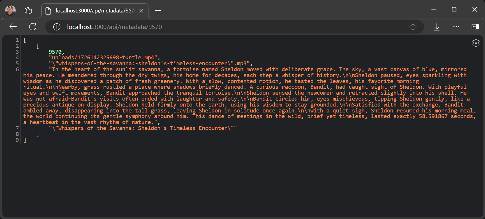

# Leveraging AI to Generate Narrative Voices and Titles for Documentary Videos


## **Introduction**

This blog focuses on leveraging AI to generate narrative voices and titles for documentary videos. We’ll explore implementing this using a tech stack that includes Node.js for backend operations, GridDB for managing video metadata, OpenAI for AI-driven text and voice generation, and React for building an interactive frontend.

## Run The Application

Clone the repository from this [link](https://github.com/junwatu/ai-narrative-and-voices) or run the following commands:

```bash
git clone https://github.com/junwatu/ai-narrative-and-voices.git
cd ai-narrative-and-voices
cd app
npm install
```

Copy the `.env.example` file to `.env` and set the `VITE_APP_URL` environment variable or leave it by default and set the `OPENAI_API_KEY` environment variable (please look at this section for more details on how to [get the OpenAI API key](#openai-key)).

To run the application, execute the following command:

```bash
npm run start:build
```
Open the browser and navigate to `http://localhost:3000/`. 

> You can customize the app address and port by setting the `VITE_SITE_URL` environment variable in the `.env` file.

## **Solving the Problem**

Creating compelling narratives and attention-grabbing titles for documentary videos presents significant challenges due to:

- **Time-Consuming Process**: Manually crafting narratives and titles is lengthy and often leads to delays, particularly under tight production schedules.
- **Creative Blocks**: Writers frequently face creative blocks, hindering the consistent generation of fresh, engaging content.
- **Scalability Issues**: Maintaining consistent quality across multiple projects becomes increasingly difficult as content volume grows.

## **Tech Stack Overview**

### OpenAI Key

To access any OpenAI services, we need a valid key. Go to this [link](https://platform.openai.com/api-keys) and create a new OpenAI key.


The OpenAI key is on a project basis, so we need to create a project first in the OpenAI platform and you need also to enable any models that you use on a project. For this project, we will need `gpt-4o` or `gpt-4o-2024-08-06`, `gpt-4o-mini` and `tts-1` models.


The OpenAI key will be saved on the `.env` file and make sure not to include it in version control by adding it to the `.gitignore`.

### Node.js

This project will run on the Node.js platform. You need to install it from [here](https://nodejs.org/en/download). For this project, we will use the `nvm` package manager and Node.js v16.20.2
LTS version.

```shell
# installs nvm (Node Version Manager)
curl -o- https://raw.githubusercontent.com/nvm-sh/nvm/v0.39.7/install.sh | bash

# download and install Node.js
nvm install 16

# verifies the right Node.js version is in the environment
node -v # should print `v16.20.2`

# verifies the right NPM version is in the environment
npm -v # should print `8.19.4``
```

To connect Node.js and GridDB database, you need the [gridb-node-api](https://github.com/nodejs/node-addon-api) npm package which is a Node.js binding developed using GridDB C Client and Node addon API.

### FFmpeg

This project utilizes the [`fluent-ffmpeg`](https://www.npmjs.com/package/fluent-ffmpeg) npm package, which requires FFmpeg to be installed on the system. For Ubuntu, you can use the following command to install it:

```shell
sudo apt update
sudo apt install ffmpeg
```

For more installation information, please go to the [FFmpeg official website](https://ffmpeg.org/).

### GridDB

To save the video summary and video data, we will use the GridDB database. Please look at the [guide](https://docs.griddb.net/latest/gettingstarted/using-apt/#install-with-apt-get) for detailed installation. We will use Ubuntu 20.04 LTS here.

Run GridDB and check if the service is running. Use this command:

```shell
sudo systemctl status gridstore
```

If not running try to run the database with this command:

```shell
sudo systemctl start gridstore
```
 
### React

We will use [React](https://react.dev/) to build the front end of the application. React lets you build user interfaces out of individual pieces called components. So if you want to expand or modify the application, you can easily do so by adding or modifying components.

## **System Architecture**


1. **Video Upload:** The browser uploads the video to the Node.js backend for processing.
2. **Video Processing:** Node.js sends the video to FFmpeg for processing tasks like encoding, decoding, or frame extraction.
3. **Processed Video Retrieval:** FFmpeg processes the video and returns the processed data to Node.js.
4. **AI Content Generation:** Node.js sends the processed video data to OpenAI for generating narrative voices and titles.
5. **Metadata Storage:** Node.js stores the video metadata and AI-generated content in GridDB.
6. **Frontend Interaction:** Node.js sends the necessary data to the React frontend for user interaction and display.

## **Node.js Server**

Node.js server is the core of the application. It is responsible for the following tasks:

- [Handle the video upload](#video-upload)
- [Frame extraction](#frame-extraction)
- [AI content generation](#ai-content-generation)
- [Audio Voice Generation](#audio-voice-generation)
- [Storing Data To GridDB](#storing-video-metadata-in-griddb)
- [Routes](#routes)

The server code is:

```js
import express from 'express'
import path from 'path'
import bodyParser from 'body-parser'
import metadataRoutes from './routes/metadataRoutes.js'
import uploadRoutes from './routes/uploadRoutes.js'
import { __dirname } from './dirname.js'

const app = express()

if (!process.env.VITE_APP_URL) {
    throw new Error('VITE_APP_URL environment variable is not set')
}
const apiURL = new URL(process.env.VITE_APP_URL)
const HOSTNAME = apiURL.hostname || 'localhost'
const PORT = apiURL.port || 3000

app.use(bodyParser.json({ limit: '10mb' }))
app.use(express.static(path.join(__dirname, 'dist')))
app.use(express.static(path.join(__dirname, 'public')))
app.use(express.static(path.join(__dirname, 'audio')))
app.use(express.static(path.join(__dirname, 'uploads')))

app.get('/', (req, res) => {
    res.sendFile(path.join(__dirname, 'dist', 'index.html'))
})

app.use('/api', uploadRoutes)
app.use('/api/metadata', metadataRoutes)

app.listen(PORT, HOSTNAME, () => {
    console.log(`Server is running on http://${HOSTNAME}:${PORT}`)
})
```

The node.js server provides routes and exposes dist, public, audio, and uploads directories to the client. The audio and upload directories are needed so later the client will be able to download the generated audio and original video files.

### Video Upload

The `api/upload` route handles the video upload and saves the video in the `uploads` folder.

```js
app.use('/api', uploadRoutes)
```

The `uploadRoutes` is defined in the `routes/uploadRoutes.js` file.

```js
router.post('/upload', upload.single('file'), async (req, res) => {
	if (!req.file) {
		return res.status(400).send('No file uploaded or invalid file type.')
	}

	try {
		// relative path
		const videoPath = path.join('uploads', req.file.filename)
		const { base64Frames, duration } = await processVideo(videoPath)
		// send frames to OpenAI
		const { narrative, title, voice } = await generateNarrative(base64Frames, duration)

		await saveDocumentaryMetadata({
		    video: videoPath, audio: voice, narrative, title
		})

		res.json({
			filename: req.file.filename,
			narrative,
			title,
			voice
		})
	} catch (error) {
		console.error('Error processing video:', error)
		res.status(500).send('Error processing video')
	}
})
```

This route is used to process the video and extract the frames and will return the base64 frames of the video and later will be sent to OpenAI for generating the narrative voices and titles. This route returns JSON data for client-side display.

### Frame Extraction

The `processVideo` function is defined in the `libs/videoprocessor.js` file. This function uses the `ffmpeg` package to extract the frames from the video.

```js
export function extractFrames(videoPath, secondsPerFrame, outputFolder, scaleFactor = 0.5) {
    return new Promise((resolve, reject) => {
        const frameRate = 1 / secondsPerFrame
        const framePattern = path.join(outputFolder, 'frame-%03d.png')
        const resizeOptions = `fps=${frameRate},scale=iw*${scaleFactor}:ih*${scaleFactor}`

        ffmpeg(videoPath)
            .outputOptions([`-vf ${resizeOptions}`])
            .output(framePattern)
            .on('end', () => {
                fs.readdir(outputFolder, (err, files) => {
                    if (err) {
                        reject(err)
                    } else {
                        const framePaths = files.map(file => path.join(outputFolder, file))
                        resolve(framePaths)
                    }
                })
            })
            .on('error', reject)
            .run()
    })
}
```

The default seconds per frame is 4 seconds. You can override this by passing the `secondsPerFrame` parameter to the `extractFrames` function. The frames will be saved in the `frames` folder.

### AI Content Generation

The `generateNarrative` is the function responsible for AI-generated titles, narratives, and audio files.

#### Generate Narrative

The `generateNarrative` function takes the base64 frames of the video as input and returns the narrative, title, and generated audio voice.

```js
async function generateNarrative(frames) {
    const videoDuration = 2

    const frameObjects = frames.map(x => ({
        type: 'image_url',
        image_url: {
            url: `data:image/png;base64,${x}`,
            detail: "low"
        }
    }));

    const videoContent = {
        role: "user",
        content: [{
                type: 'text',
                text: `The original video, in which frames are generated  is ${videoDuration} seconds. Create a story based on these frames that fit for exactly ${videoDuration} seconds. BE CREATIVE. DIRECT ANSWER ONLY.`
            },
            ...frameObjects
        ],
    }

    const response = await openai.chat.completions.create({
        model: "gpt-4o",
        messages: [{
                role: "system",
                content: "You are a professional storyteller."
            },
            videoContent
        ],
        temperature: 1,
        max_tokens: 4095,
        top_p: 1,
        frequency_penalty: 0,
        presence_penalty: 0,
        response_format: {
            "type": "text"
        },
    });

    if (response.choices[0].finish_reason === 'stop') {
        const narrative = response.choices[0].message.content
        const title = await generateTitle(narrative)

        const fileName = title.split(' ').join('-').toLowerCase()
        const voice = await generateSpeechToFile(narrative, 'audio', fileName)

        return {
            narrative,
            title,
            voice
        }
    } else {
        throw new Error('Failed to generate narrative')
    }
}
```

To generate the narrative text, we use prompt engineering to guide the AI model. The prompt is a text that includes the video frames and the video duration:

```text
The original video, in which frames are generated  is ${videoDuration} seconds. Create a story based on these frames that fit for exactly ${videoDuration} seconds. BE CREATIVE. DIRECT ANSWER ONLY.
```

This function also uses the `generateTitle` function to generate the title and the `generateSpeechToFile` function to generate audio voice.

#### Generate Title

The `generateTitle` function takes the narrative text as input and returns the title.

```js
async function generateTitle(narrative) {
    const titleResponse = await openai.chat.completions.create({
        model: 'gpt-4o-mini',
        messages: [{
                role: 'system',
                content: 'You are a professional storyteller.'
            },
            {
                role: 'user',
                content: `Direct answer only. Generate a title for the following narrative text: \n${narrative}`
            }
        ],
        temperature: 1,
        max_tokens: 1000,
        top_p: 1,
        frequency_penalty: 0,
        presence_penalty: 0,
        response_format: {
            type: 'text'
        }
    })

    const title = titleResponse.choices[0].message.content
    return title
}
```

The model used here is `gpt-4o-mini` which is a smaller version of the `gpt-4o` model and it's very good to generate a unique title.

### Audio Voice Generation

The `generateSpeechToFile` function will generate an audio voice based on the given text input. We use the `tts-1` AI model, which is a powerful text-to-speech model from OpenAI. The generated audio style can be selected from a few produced sound styles. In this project, we will use a `shimmer` voice style.

```js
async function generateSpeechToFile(text, folderPath, fileName, model = 'tts-1', voice = 'shimmer') {
	try {
		if (!fs.existsSync(folderPath)) {
			await fs.promises.mkdir(folderPath, { recursive: true });
		}
        
		const mp3Filename = `${fileName}.mp3`
		const outputFilePath = path.join(folderPath, mp3Filename);
		const mp3 = await openai.audio.speech.create({
			model,
			voice,
			input: text,
		});

		const buffer = Buffer.from(await mp3.arrayBuffer());
		await fs.promises.writeFile(outputFilePath, buffer);
		console.log(`File saved at: ${outputFilePath}`);
		return mp3Filename;
	} catch (error) {
		console.error('Error generating speech:', error);
		throw error;
	}
}
```

The generated audio will be saved as an MP3 file in the specified folder. This audio file can be combined with the original video footage to create a compelling documentary-style video.

### Connect To GridDB

The `griddb.cjs` file is responsible to connect to the GridDB database and the `gridDBService.js` is a wrapper for easy code. These are the methods we use in this project.

| Function Name               | Description                                                           |
|-----------------------------|------------------------------------------------------------------------------|
| `saveDocumentaryMetadata`   | Saves documentary metadata (video, audio, narrative, title) to the database. |
| `getDocumentaryMetadata`    | Retrieves documentary metadata by its ID.                                    |
| `getAllDocumentaryMetadata` | Retrieves all documentary metadata stored in the database.                   |

### Storing Video Metadata in GridDB

The GridDB database will store **the video file path**, **audio voice filename**, **generated narrative**, and **title**. This ensures efficient retrieval and management of all essential documentary metadata.

After uploading and processing the video by OpenAI. The metadata will be saved into the database using the `saveDocumentaryMetadata` function.

```js
await saveDocumentaryMetadata({ video: videoPath, audio: voice, narrative, title })
```

This function is also accessible directly in the `/api/metadata` route using the `POST HTTP` method. Other metadata routes are accessible directly using the `/api/metadata` route. Please look at the [routes section](#routes) for route details.

### Get Videos Metadata

To get the video metadata, you can use the `GET` method  in the `/api/metadata` to retrieve all saved data and use the `/api/metadata/:docId` to get the specific video metadata.


### Get Video By ID

To get video metadata based on the ID, you can use the `GET` method in the `/api/metadata/:id` route with `id` as the data identifier as the query parameter.



### Routes

Here are the routes list for the Node.js server in this project:

| HTTP Method | Route                      | Description                                                 | File                |
|-------------|----------------------------|-------------------------------------------------------------|---------------------|
| GET         | `/api/metadata`             | Fetch all documentary metadata                               | `metadataRoutes.js` |
| GET         | `/api/metadata/:docId`      | Fetch metadata for a specific documentary                    | `metadataRoutes.js` |
| POST        | `/api/metadata`             | Save or update documentary metadata                          | `metadataRoutes.js` |
| POST        | `/api/upload`               | Upload and process a video file (MP4 format only)            | `uploadRoutes.js`   |

## User Interface


The user interface is built with React.js, providing a modern, component-based architecture. This choice of technology stack enables developers to easily customize and expand the user interface to meet evolving project requirements or incorporate new features in the future.

The main UI is a simple file uploader react component. The component source code is in the `components/FileUpload.jsx` file.
The `handleUpload` function will upload the file to the `/api/upload` route and will handle the data response for further processing.

```jsx
const handleUpload = async () => {
    if (!file) {
        setUploadStatus('Please select a file first.')
        return
    }

    const formData = new FormData()
    formData.append('file', file)

    try {
        setUploadStatus('Uploading...')
        const response = await fetch('/api/upload', {
            method: 'POST',
            body: formData,
        })

        if (!response.ok) {
            throw new Error('Network response was not ok')
        }

        const data = await response.json()
        setUploadData(data)
        setUploadStatus('Upload successful!')
    } catch (error) {
        console.error('Error uploading file:', error)
        setUploadStatus('Error uploading file. Please try again.')
    }
}
```

## Demo


Other than the details response data, the user can also download the generated narrative audio and the original video files.

## Further Enhancements

These are enhancements recommendations to make this base project better and usable:

- Add video composer function which composes the generated narrative audio and the original video.
- Add longer video duration upload.
- Add a video user interface to show the final result.

## Code Repository Link

[Github](https://github.com/junwatu/ai-narrative-and-voices/tree`/main/app)
