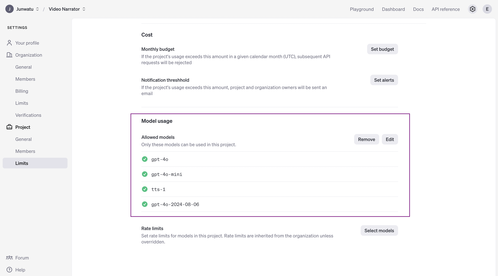

# Leveraging AI to Generate Narrative Voices and Titles for Documentary Videos


## **Introduction**

This blog focuses on leveraging AI to generate narrative voices and titles for documentary videos. We’ll explore how to implement this using a tech stack that includes Node.js for backend operations, GridDB for managing video metadata, OpenAI for AI-driven text and voice generation, and React for building an interactive frontend.

## Run The Application

Clone the repository from this [link](https://github.com/junwatu/ai-narrative-and-voices) or run the following commands:

```bash
git clone https://github.com/junwatu/ai-narrative-and-voices.git
cd ai-narrative-and-voices
cd app
npm install
```

Copy the `.env.example` file to `.env` and set the `VITE_APP_URL` environment variable or leave it by default and set the `OPENAI_API_KEY` environment variable (please look at this section for more details on how to [get the OpenAI API key](#)).

To run the application, execute the following command:

```bash
npm run start:build
```
Open the browser and navigate to `http://localhost:3000/`. 

> You can also customize the app address and port by setting the `VITE_SITE_URL` environment variable in the `.env` file.

## **Solving the Problem**

Creating compelling narratives and attention-grabbing titles for documentary videos presents significant challenges due to:

- **Time-Consuming Process**: Manually crafting narratives and titles is lengthy and often leads to delays, particularly under tight production schedules.
- **Creative Blocks**: Writers frequently face creative blocks, hindering the consistent generation of fresh, engaging content.
- **Scalability Issues**: As content volume grows, maintaining consistent quality across multiple projects becomes increasingly difficult.


## **Tech Stack Overview**

### OpenAI Key

To access any OpenAI services, we need a valid key. Go to this [link](https://platform.openai.com/api-keys) and create a new OpenAI key.


The OpenAI key is on a project basis, so we need to create a project first in the OpenAI platform and you need also to enable any models that you use on a project. For this project, we will need `gpt-4o`, `gpt-4o-mini` and `tts-1` models.



The OpenAI key will be saved on the `.env` file and make sure not to include it in version control by adding it to the `.gitignore`.

### Node.js

This project will run on the Node.js platform. You need to install it from [here](https://nodejs.org/en/download). For this project, we will use the `nvm` package manager and Node.js v16.20.2
LTS version.

```shell
# installs nvm (Node Version Manager)
curl -o- https://raw.githubusercontent.com/nvm-sh/nvm/v0.39.7/install.sh | bash

# download and install Node.js
nvm install 16

# verifies the right Node.js version is in the environment
node -v # should print `v16.20.2`

# verifies the right NPM version is in the environment
npm -v # should print `8.19.4``
```

To connect Node.js and GridDB database, you need the [gridb-node-api](https://github.com/nodejs/node-addon-api) npm package which is a Node.js binding developed using GridDB C Client and Node addon API.

### FFmpeg

This project utilizes the [`fluent-ffmpeg`](https://www.npmjs.com/package/fluent-ffmpeg) npm package, which requires FFmpeg to be installed on the system. For Ubuntu, you can use the following command to install it:

```shell
sudo apt update
sudo apt install ffmpeg
```

For more installation information, please go to the [FFmpeg official website](https://ffmpeg.org/).

### GridDB

To save the video summary and video data, we will use the GridDB database. Please look at the [guide](https://docs.griddb.net/latest/gettingstarted/using-apt/#install-with-apt-get) for detailed installation. We will use Ubuntu 20.04 LTS here.

Run GridDB and check if the service is running. Use this command:

```shell
sudo systemctl status gridstore
```

If not running try to run the database with this command:

```shell
sudo systemctl start gridstore
```
 
### React

We will use [React](https://react.dev/) to build the frontend of the application. React lets you build user interfaces out of individual pieces called components. So if you want to expand or modify the application, you can easily do so by adding or modifying components.

## **System Architecture**


1. **Video Upload:** The browser uploads the video to the Node.js backend for processing.
2. **Video Processing:** Node.js sends the video to FFmpeg for processing tasks like encoding, decoding, or frame extraction.
3. **Processed Video Retrieval:** FFmpeg processes the video and returns the processed data to Node.js.
4. **AI Content Generation:** Node.js sends the processed video data to OpenAI for generating narrative voices and titles.
5. **Metadata Storage:** Node.js stores the video metadata and AI-generated content in GridDB.
6. **Frontend Interaction:** Node.js sends the necessary data to the React frontend for user interaction and display.

## **Node.js Server**

Node.js server is the core of the application. It is responsible for the following tasks:

- Handle the video upload
- Frame extraction
- AI content generation
- Connect to GridDB
- Routes

### Video Upload

The `api/upload` route handles the video upload and saves the video the `uploads` folder.

```js
app.use('/api', uploadRoutes)  // Add the upload routes
```

The `uploadRoutes` is defined in the `routes/uploadRoutes.js` file.

```js
router.post('/upload', upload.single('file'), async (req, res) => {
	if (!req.file) {
		return res.status(400).send('No file uploaded or invalid file type.')
	}
	try {
		const videoPath = path.join(__dirname, 'uploads', req.file.filename)
		const { base64Frames } = await processVideo(videoPath)

		// send frames to OpenAI

		res.json({
			message: `File uploaded and processed: ${req.file.filename}`,
			frames: base64Frames,
			filename: videoPath
		})
	} catch (error) {
		console.error('Error processing video:', error)
		res.status(500).send('Error processing video')
	}
})
```
This route is used to process the video and extract the frames and will returns the base64 frames of the video and later will be sent to OpenAI for generating the narrative voices and titles.

### Frame Extraction

The `processVideo` function is defined in the `libs/videoprocessor.js` file. This function uses the `ffmpeg` package to extract the frames from the video.

```js
export function extractFrames(videoPath, secondsPerFrame, outputFolder, scaleFactor = 0.5) {
	return new Promise((resolve, reject) => {
		const frameRate = 1 / secondsPerFrame
		const framePattern = path.join(outputFolder, 'frame-%03d.png')
		const resizeOptions = `fps=${frameRate},scale=iw*${scaleFactor}:ih*${scaleFactor}`

		ffmpeg(videoPath)
			.outputOptions([`-vf ${resizeOptions}`])
			.output(framePattern)
			.on('end', () => {
				fs.readdir(outputFolder, (err, files) => {
					if (err) {
						reject(err)
					} else {
						const framePaths = files.map(file => path.join(outputFolder, file))
						resolve(framePaths)
					}
				})
			})
			.on('error', reject)
			.run()
	})
}
```

The default seconds per frame is 4 seconds. You can override this by passing the `secondsPerFrame` parameter to the `extractFrames` function. The frames will be saved in the `frames` folder.

### AI Content Generation

The routes `/api/generate/narrative` and `/api/generate/title` are used to generate the narrative and title of the video. The `generateNarrative` and `generateTitle` functions are responsible for generating the narrative and title of the video. These functions are defined in the `services/openAIService.js` file.

#### Generate Narrative

The `generateNarrative` function is used to generate the narrative of the video. It takes the base64 frames of the video as input and returns the narrative of the video.

```js
async function generateNarrative(frames, videoDuration = 2) {
) {
	const frameObjects = frames.map(x => ({
		type: 'image_url',
		image_url: {
			url: `data:image/png;base64,${x}`,
			detail: "low"
		}
	}));

	const videoContent = {
		role: "user",
		content: [
			{ type: 'text', text: `The original video, in which frames are generated  is ${videoDuration} seconds. Create a story based on these frames. BE CREATIVE. DIRECT ANSWER ONLY.` },
			...frameObjects
		],
	}

	const response = await openai.chat.completions.create({
		model: "gpt-4o",
		messages: [
			{
				role: "system",
				content: "You are a professional storyteller."
			},
			videoContent
		],
		temperature: 1,
		max_tokens: 4095,
		top_p: 1,
		frequency_penalty: 0,
		presence_penalty: 0,
		response_format: {
		  "type": "text"
		},
	});

	const narrativeResponse = response.choices[0].message.content
	return narrativeResponse;
}
```

To generate the narrative text, we use prompt engineering to guide the AI model. The prompt is a text that includes the video frames and the video duration:

```text
The original video, in which frames are generated  is ${videoDuration} seconds. Create a story based on these frames. BE CREATIVE. DIRECT ANSWER ONLY.
```

#### Generate Title

The `generateTitle` function is used to generate the title of the video. It takes the narrative text as input and returns the title.

```js
async function generateTitle(narrative) {
	const titleResponse = await openai.chat.completions.create({
		model: 'gpt-4o-mini',
		messages: [
			{
				role: 'system',
				content: 'You are a professional storyteller.'
			},
			{
				role: 'user',
				content: `Direct answer only. Generate a title for the following narrative text: \n${narrative}`
			}
		],
		temperature: 1,
		max_tokens: 1000,
		top_p: 1,
		frequency_penalty: 0,
		presence_penalty: 0,
		response_format: {
			type: 'text'
		}
	})

	const title = titleResponse.choices[0].message.content
	return title
}
```

The model used here is `gpt-4o-mini` which is a smaller version of `gpt-4o` model.

### Connect to GridDB

### Routes


## **AI Content Generation Workflow**

[DRAFT]


### **Creating Narrative Descriptions**

Using OpenAI’s `gpt-4o` model to generate impactful and attention-grabbing description and title based on the video’s content.

### **Generating Narrative Voices**

Using OpenAI’s `whisper` model to produce engaging and relevant narrative content.

### **Storing Video Metadata in GridDB**

How metadata like themes, topics, and timestamps help refine AI output.

## User Interface

[DRAFT]

## Demo

[DRAFT] 

## **Repository Link**

[Github project source code](https://github.com/junwatu/ai-narrative-and-voices/tree`/main/app)
